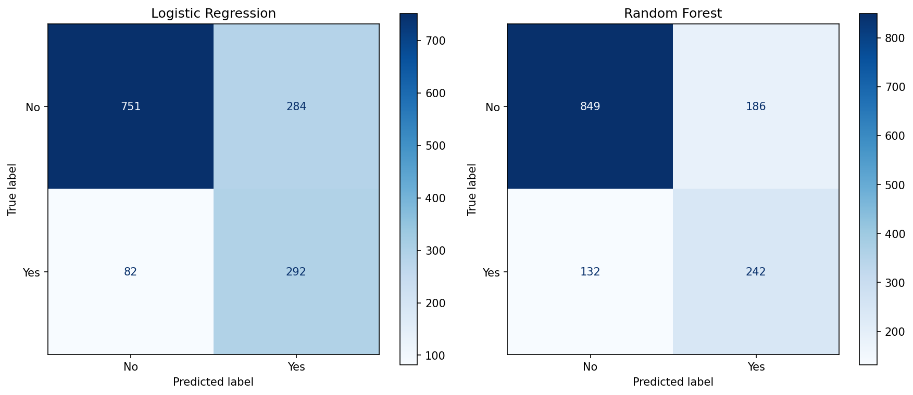

# 📊 Predição de Churn em Telecom — Synapsee

---

## 1. O Desafio

Três SLAs definidos **antes** de escrever qualquer código:

| SLA | Meta | Resultado |
| --- | --- | --- |
| Recall (Churn) | ≥ 70% | ✅ **78.07%** |
| Macro F1-Score | ≥ 70% | ✅ **70.94%** |
| Gap Treino/Teste | ≤ 10pp | ✅ **1.47pp** |

> *"Sem meta, qualquer resultado parece bom."*

---

## 2. A História dos Dados

### O "Combo Tóxico" do Churn

| Fator de Risco | Taxa de Churn | Média Global |
| --- | --- | --- |
| Contrato Mensal | **42.7%** | 26.5% |
| Fibra Óptica | **41.9%** | 26.5% |
| Sem Suporte Técnico | **41.6%** | 26.5% |
| Electronic Check | **45.3%** | 26.5% |


### A "UTI dos 6 Meses"

- Mediana de tenure para quem cancela: **10 meses**
- Mediana para quem fica: **38 meses**
- Correlação tenure × Churn: **r = -0.35** (p < 10⁻²⁰⁵)

> *Metade dos churners sai antes de completar 1 ano.*


---

## 3. A Cozinha Técnica

### LR vs RF — O Básico que Vence o Complexo

| Critério | Logistic Regression | Random Forest |
| --- | --- | --- |
| Recall (Churn) | **0.78** ✅ | 0.65 ❌ |
| Macro F1 (Teste) | 0.71 | 0.72 |
| Gap Treino/Teste | **1.47pp** ✅ | 18.02pp ❌ |
| Interpretável? | ✅ Coeficientes | ❌ Black-box |

> *A RF "decorou" os padrões — Gap de 18pp é overfitting. A LR generalizou.*



---

## 4. A Entrega de Valor

### Features com Significado de Negócio

- **`TicketMedio`** = TotalCharges / tenure → *"Quanto o cliente gasta por mês, de verdade?"*
- **`NumServicos`** = soma de 8 serviços → *Índice de Ancoragem — mais serviços = mais fricção de saída*

### Score de Risco → Filas de Ação

| Tier | Clientes | % | Ação |
| --- | --- | --- | --- |
| 🔴 Alto Risco (71-100) | **1.640** | 23.3% | Ligação imediata |
| 🟡 Risco Médio (31-70) | 2.476 | 35.2% | Campanha preventiva |
| 🟢 Baixo Risco (0-30) | 2.927 | 41.6% | E-mail automático |

> *10 operadores × 20 ligações/dia = fila de Alto Risco coberta em ~8 dias úteis.*

---

## 5. Arquitetura de Produção

```
CSV bruto → validate_columns() → preprocess → predict → score → tiers
                     ↓                                        ↓
              st.warning()                          Tabela de Ação
              (falha graceful)                      (base ativa only)
```

### MLOps Básico

- **`inference.py`** → módulo analítico (notebooks)
- **`inference_app.py`** → módulo de produção (Streamlit)
- **`@st.cache_resource`** → modelo carregado 1× na memória
- **Filtro de base ativa** → ex-clientes ocultos da fila de retenção

> *O modelo não vive no Jupyter. Ele vive na mesa de operação.*
