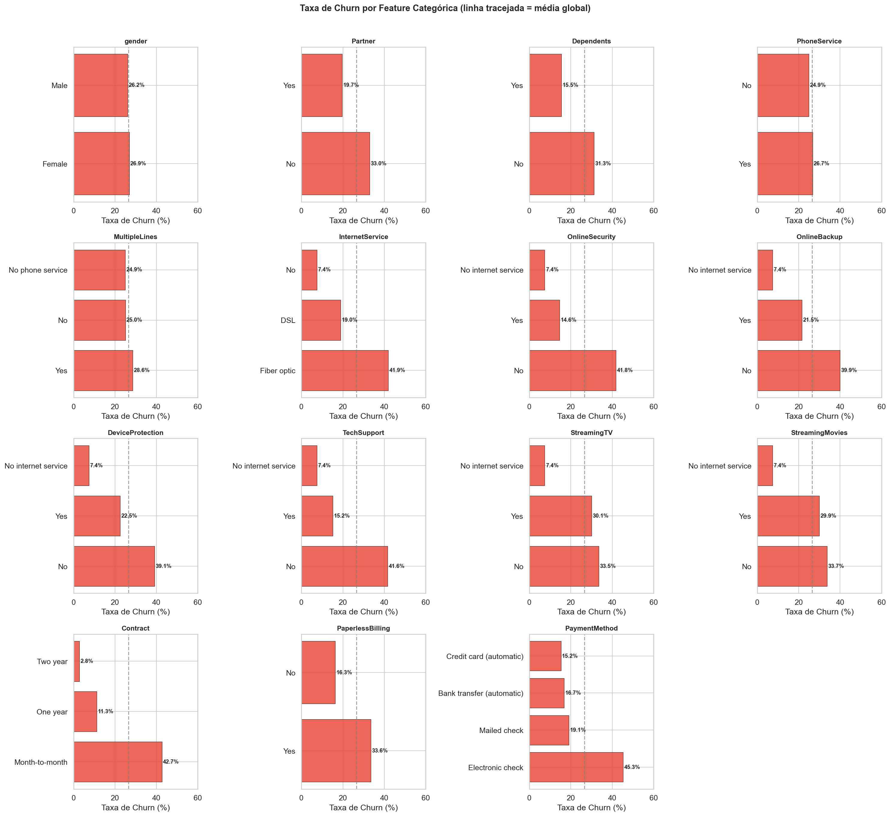
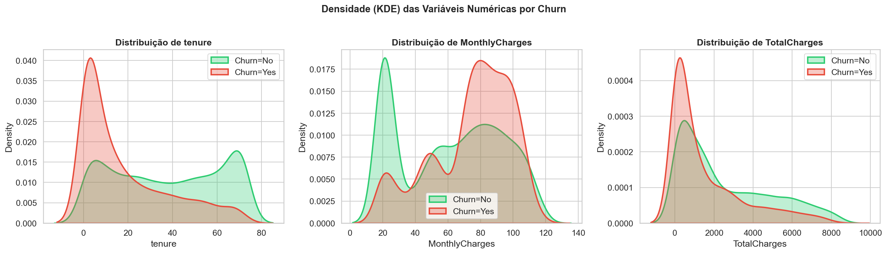
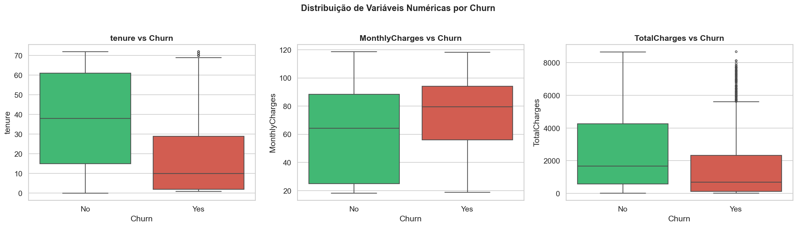
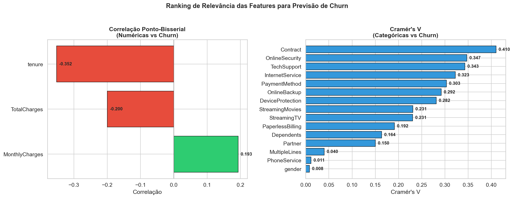
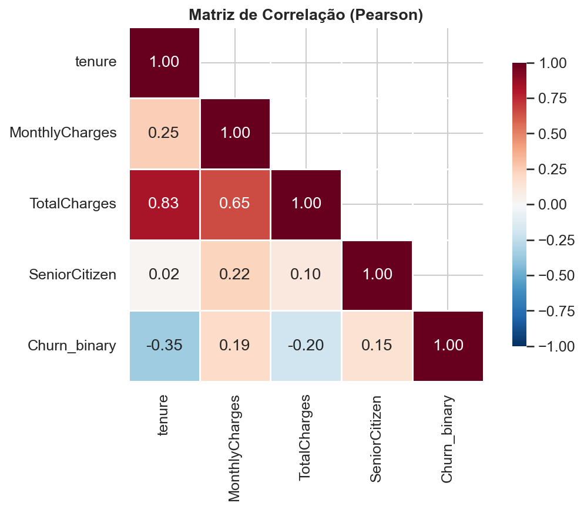
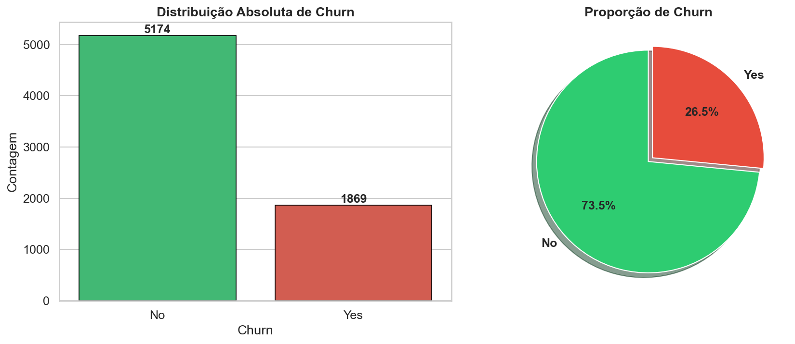

# Relatório Técnico de Desenvolvimento e Trade-offs

Este documento consolida o histórico de decisões arquiteturais e analíticas para fins de auditoria e apresentação final.

---

## Decisões Aprovadas — Etapa 1 (EDA)

### Etapa 1 - Tratamento de Nulos em `TotalCharges`

* **Contexto:** 11 registros com `TotalCharges` em branco. Todos possuem `tenure=0` (clientes recém-chegados sem cobrança acumulada). São nulos semânticos, não erros de cadastro.
* **Alternativas Consideradas:**
  * (A) Imputar com 0 — Coerente semanticamente (sem tempo de vida = sem cobrança). Simples e interpretável.
  * (B) Remover as 11 linhas — Perda de 0.15% da base, mas elimina informação de perfil de clientes novíssimos.
* **Trade-off:** Opção A preserva todos os registros e é fiel à lógica de negócio. Opção B é mais conservadora, mas descarta informação de um segmento relevante (clientes recém-chegados).
* **Decisão Final:** ✅ Opção **A — Imputar com 0**. Aprovada pelo usuário.
* **Impacto Esperado:** Mantém integridade do dataset (7043 registros) e permite criação da feature derivada `TicketMedio`.

### Etapa 1 - Multicolinearidade e Criação de `TicketMedio`

* **Contexto:** `tenure` e `TotalCharges` possuem correlação de Pearson de ~0.83. Manter ambas introduz redundância e instabilidade nos coeficientes de modelos lineares.
* **Alternativas Consideradas:**
  * (A) Manter ambas — redundância no modelo, mas nenhuma perda de informação.
  * (B) Dropar `TotalCharges` e criar `TicketMedio = TotalCharges / tenure` — elimina colinearidade e gera feature com significado de negócio direto.
  * (C) Manter ambas + criar `TicketMedio` — decidir com seleção de features posterior.
* **Trade-off:** Opção B é mais limpa e interpretável. Opção C dá mais flexibilidade ao custo de manter variáveis correlacionadas. Opção A é a mais arriscada para modelos lineares.
* **Decisão Final:** ✅ Opção **B — Dropar `TotalCharges`, criar `TicketMedio`**. Aprovada pelo usuário.
* **Impacto Esperado:** Elimina multicolinearidade e adiciona feature com significado direto de negócio (gasto médio por mês de permanência).

### Etapa 1 - Estratégia de Balanceamento de Classes

* **Contexto:** Razão de desbalanceamento de 2.77:1 (73.5% No / 26.5% Yes). Moderado, mas capaz de enviesar modelos para a classe majoritária.
* **Alternativas Consideradas:**
  * (A) SMOTE no treino — Gera exemplos sintéticos da classe minoritária. Risco de data leakage se mal implementado.
  * (B) `class_weight='balanced'` — Penaliza erros na classe minoritária via pesos internos do modelo. Simples, sem alterar o dataset.
  * (C) Testar ambas abordagens e comparar.
* **Trade-off:** Opção B é mais segura e simples como baseline. SMOTE pode aumentar Recall mas introduz risco de overfitting em amostras sintéticas.
* **Decisão Final:** ✅ Opção **B — `class_weight='balanced'`** como baseline. Aprovada pelo usuário.
* **Impacto Esperado:** Decisão direta no Recall da classe 1 (SLA de ≥70%). Abordagem será aplicada na Etapa 3 (Modelagem).

---

## Defesa Técnica EDA — Insights de Negócio com Evidências

> Esta seção resume os achados da Etapa 1 em formato de storytelling, com evidências visuais e dados de suporte para a apresentação ao vivo.

### Quem é o "vilão" do Churn?

O perfil de maior risco de cancelamento é o **cliente de contrato mensal com fibra óptica e sem serviços de proteção**. Os dados comprovam:

| Feature | Categoria de Risco | Taxa de Churn | Média Global |
| --- | --- | --- | --- |
| Contract | Month-to-month | **42.7%** | 26.5% |
| InternetService | Fiber optic | **41.9%** | 26.5% |
| OnlineSecurity | No | **41.8%** | 26.5% |
| TechSupport | No | **41.6%** | 26.5% |
| PaymentMethod | Electronic check | **45.3%** | 26.5% |

Em contraste, contratos anuais (11.3%) e bianuais (2.8%) praticamente eliminam o churn. Pagamentos automáticos (cartão: 15.2%, transferência: 16.7%) também indicam maior fidelização.

### O Impacto do `tenure` (Tempo de Casa)

O `tenure` é a variável numérica com **maior correlação com Churn** (r = **-0.3522**, p < 10⁻²⁰⁵):

| Métrica | Churn = No | Churn = Yes |
| --- | --- | --- |
| Média de tenure (meses) | 37.6 | 18.0 |
| Mediana de tenure (meses) | 38 | **10** |
| Desvio padrão | 24.1 | 19.5 |

Clientes que cancelam têm mediana de **10 meses** — metade se vai antes de completar 1 ano. A distribuição KDE revela um pico massivo de churn nos primeiros 6 meses (a "janela de perigo") e estabilização após ~24 meses.

---

### Insight 1 — "O Combo Tóxico"

Um cliente com *contrato mensal + fibra óptica + sem suporte técnico + pagamento por electronic check* é um alvo quase certo de churn. Cada uma dessas 4 características individualmente já eleva a taxa acima da média (~26.5%), e combinadas representam o caso extremo.

**Dados de suporte:**

| Característica | Taxa de Churn Individual |
| --- | --- |
| Contract = Month-to-month | 42.7% |
| InternetService = Fiber optic | 41.9% |
| TechSupport = No | 41.6% |
| PaymentMethod = Electronic check | 45.3% |

**Evidência visual:** Os gráficos de taxa de churn por categórica mostram que todas essas categorias ultrapassam a linha tracejada (média global) por larga margem.

---

### Insight 2 — "Os Primeiros 6 Meses Decidem Tudo"

A maior concentração de cancelamentos acontece em clientes com menos de 6 meses de casa. A empresa precisa tratar esses clientes como em "UTI" — cada mês que passa sem cancelar reduz exponencialmente o risco.

**Dados de suporte:**

* Mediana de tenure para Churn=Yes: **10 meses**
* Mediana de tenure para Churn=No: **38 meses**
* Correlação ponto-bisserial tenure × Churn: **r = -0.3522** (p < 10⁻²⁰⁵)

**Implicação para o negócio:** Programas de retenção devem ser mais agressivos no primeiro semestre de contrato. Após ~24 meses, o risco de cancelamento se torna residual.

---

### Insight 3 — "O Paradoxo da Fibra Óptica"

O serviço mais premium (Fiber optic) tem a **maior taxa de cancelamento** (41.9%), enquanto DSL (19.0%) e sem internet (7.4%) retêm mais. Isso sugere uma **desconexão entre preço e valor percebido**.

**Dados de suporte:**

| Tipo de Internet | Taxa de Churn | MonthlyCharges Médio* |
| --- | --- | --- |
| Fiber optic | **41.9%** | ~$80-90 |
| DSL | 19.0% | ~$50-60 |
| No | 7.4% | ~$20 |

*Faixas estimadas a partir dos boxplots.

Clientes pagam mais caro por fibra, mas sem os serviços complementares (segurança online: 14.6% de churn com, 41.8% sem; suporte técnico: 15.2% com, 41.6% sem), a insatisfação dispara. O churn não é do serviço em si — é da falta de "ecossistema de valor" ao redor dele.

---

### Tabela de Correlações — Top 5 Features com Maior Impacto no Churn

#### Variáveis Categóricas (Cramér's V)

| Rank | Feature | Cramér's V | Interpretação |
| --- | --- | --- | --- |
| 1 | Contract | **0.4101** | Month-to-month dispara churn; contratos longos retêm |
| 2 | OnlineSecurity | **0.3474** | Ausência de segurança online eleva churn em ~3x |
| 3 | TechSupport | **0.3429** | Ausência de suporte técnico tem efeito similar |
| 4 | InternetService | **0.3225** | Fiber optic paradoxalmente lidera cancelamentos |
| 5 | PaymentMethod | **0.3034** | Electronic check concentra 45% de churn |

#### Variáveis Numéricas (Correlação Ponto-Bisserial)

| Feature | Correlação (r) | p-valor | Direção |
| --- | --- | --- | --- |
| tenure | **-0.3522** | 8.00e-205 | Mais tempo de casa → menos churn |
| TotalCharges | **-0.1995** | 4.88e-64 | Mais gasto acumulado → menos churn (correlação com tenure) |
| MonthlyCharges | **+0.1934** | 2.71e-60 | Cobranças mensais altas → mais churn |

---

### Resumo da Varredura de Qualidade de Dados

Varredura sistêmica executada em **100% das colunas** (21 variáveis) para demonstrar rigor metodológico:

| Verificação | Resultado |
| --- | --- |
| NaN explícitos (`isnull`) | 0 |
| Nulos ocultos (espaços em branco) | 11 em `TotalCharges` (tenure=0) — tratados |
| Marcadores disfarçados (`?`, `NA`, `N/A`, `null`, `-`) | 0 |
| Valores negativos (todas as numéricas) | 0 |
| `SeniorCitizen` fora de {0, 1} | 0 |
| `tenure` acima de 10 anos | 0 (máx: 72 meses = 6 anos) |
| `MonthlyCharges` == 0 | 0 |
| Duplicatas de `customerID` | 0 |

**Conclusão:** Base limpa. Único tratamento aplicado: imputação de TotalCharges com 0 nos 11 registros com tenure=0.

---

## Decisões Aprovadas — Etapa 2 (Pipeline de Features)

### Etapa 2 - Estratégia de Encoding e Colapso de Categorias

* **Contexto:** 14 variáveis categóricas para transformar matematicamente (binárias, ternárias e multiclasse).
* **Decisão Final:** ✅ Mapeamento manual para binárias e ternárias que possuíam o valor "No internet/phone service" (colapsadas para 0, eliminando esparsidade sem perda de sinal). One-Hot Encoding (com `drop_first=True`) para as multiclasses reais (`InternetService` e `PaymentMethod`). O contrato (`Contract`) recebeu codificação ordinal devido à queda monotônica do churn observada na EDA.
* **Impacto Esperado:** Dataset limpo, compacto e livre da explosão dimensional de dummies puras, otimizado para a performance de algoritmos baseados em árvores e logística.

### Etapa 2 - Estratégia de Escalonamento

* **Contexto:** Dados numéricos como `TotalCharges`, `TicketMedio` e `tenure` variam em ordens de grandeza distintas. Escaloná-los na base pode gerar "data leakage".
* **Decisão Final:** ✅ Adiar o escalonamento. Os dados exportados não sofrem normalização ou padronização.
* **Impacto Esperado:** A responsabilidade de escalar features numéricas será inserida na pipeline do modelo no Scikit-Learn durante a Etapa 3. Garante que os testes no Streamlit não precisarão aplicar scalers manualmente à base enviada.

### Etapa 2 - Feature Engineering: Criando `NumServicos`

* **Contexto:** Após as transformações, havia espaço para derivar valor a partir do engajamento do cliente com o portfólio.
* **Decisão Final:** ✅ Criar a variável `NumServicos`, calculada pela soma das 8 flags binárias de serviços (Net e Telefone).
* **Impacto Esperado:** Captura linearmente o nível de "ancoragem" do cliente. Quanto maior a pontuação, maior o custo de mudança do cliente, fornecendo à modelagem uma representação clara da aderência aos produtos da operadora.

---

### Storytelling de Features (Etapa 2)

Durante o pré-processamento, criamos duas novas variáveis que vão muito além do aspecto matemático — elas traduzem o comportamento financeiro e de engajamento do cliente para a linguagem de negócios:

1. **`TicketMedio` (O Valor Real do Cliente):**
   A base original trazia apenas o gasto do último mês (`MonthlyCharges`) e o gasto total acumulado histórico (`TotalCharges`). O problema é que o gasto acumulado mascara a realidade: um cliente antigo com um plano barato pode ter o mesmo gasto acumulado que um cliente muito recente com um plano caríssimo.
   * **A Solução:** Criamos o `TicketMedio` (`TotalCharges / tenure`). Ele responde à pergunta: *"Quanto, em média, esse cliente tirou do bolso por mês desde que entrou?"*. Se o `MonthlyCharges` é muito diferente do `TicketMedio`, sabemos que o cliente sofreu *upsell* (comprou mais coisas) ou *downsell* (cancelou serviços) ao longo do tempo.

2. **`NumServicos` (O Índice de Ancoragem e Fricção de Saída):**
   A operadora não vende apenas internet; ela vende um "ecossistema" (Telefone, Múltiplas Linhas, Segurança, Backup, Proteção de Dispositivo, Suporte Técnico, TV e Filmes). 
   * **A Solução:** Criamos a métrica `NumServicos` (soma simples de todos os serviços que o cliente possui). Na perspectiva de comportamento do consumidor, essa pontuação mede o **Custo de Mudança**. Cancelar um plano de internet é fácil. Mas cancelar a internet, o telefone da casa, a proteção do computador, perder o backup na nuvem e os canais de TV ao mesmo tempo gera atrito. Quanto maior o `NumServicos`, mais "ancorado" o cliente está ao ecossistema da empresa, reduzindo drasticamente o risco de migração (Churn) para a concorrência.

---

## Decisões Aprovadas — Etapa 3 (Modelagem Preditiva)

### Etapa 3 - Escolha de Algoritmos: Logistic Regression vs Random Forest

* **Contexto:** O PLANO exige comparação de pelo menos dois algoritmos com trade-off entre interpretabilidade e performance.
* **Alternativas Consideradas:**
  * (A) Logistic Regression — Coeficientes diretamente traduzíveis para log-odds. Baseline interpretável. Requer escalonamento.
  * (B) Random Forest — Ensemble de árvores que captura interações não-lineares. Feature importance nativa. Invariante a escala.
  * (C) XGBoost — Boosting sequencial com gradiente. Potencialmente ~1-3pp superior ao RF, mas com ~9 hiperparâmetros críticos.
* **Trade-off:** XGBoost foi deliberadamente descartado: margem de ganho não justifica a complexidade de tuning sob restrição de tempo, e a explicação na defesa técnica seria substancialmente mais difícil ("boosting com gradiente + regularização L1/L2" vs "bagging + votação de árvores").
* **Decisão Final:** ✅ LR (baseline interpretável) + RF (performance). Aprovado pelo usuário.
* **Impacto Esperado:** Comparação clara e defensável. Se RF não superar LR significativamente, reforça o argumento do "básico bem feito".

### Etapa 3 - Seleção do Modelo Campeão

* **Contexto:** Ambos os modelos foram tunados via RandomizedSearchCV (scoring=Macro F1, 5-fold stratified). Resultados no holdout:

| Modelo | Recall (Churn) | Precision (Churn) | Macro F1 (Teste) | Macro F1 (Treino) | Gap (pp) | ROC-AUC |
| --- | --- | --- | --- | --- | --- | --- |
| **Logistic Regression** | **0.7807** | 0.5069 | **0.7094** | 0.7241 | **1.47** | **0.8384** |
| Random Forest | 0.6471 | 0.5654 | 0.7229 | 0.9031 | 18.02 | 0.8363 |

* **Alternativas Consideradas:**
  * (A) Selecionar RF pelo Macro F1 bruto ligeiramente superior (0.72 vs 0.71).
  * (B) Selecionar LR como única a atender os 3 SLAs simultaneamente.
* **Trade-off:** A RF apresentou Macro F1 marginalmente superior (+1.3pp), mas com **overfitting severo** (gap de 18pp vs SLA de ≤10pp) e **Recall insuficiente** (0.65 vs SLA de ≥0.70). A LR generaliza de forma robusta (gap de apenas 1.5pp) e captura 78% dos churners reais.
* **Decisão Final:** ✅ **Logistic Regression** como modelo campeão. Hiperparâmetros: `C=0.01` (regularização forte), `solver=lbfgs`.
* **Impacto Esperado:** Modelo robusto, interpretável e com probabilidades naturalmente bem calibradas para alimentar o Score de Risco (Etapa 4). A regularização forte (C=0.01) confirma que o modelo prioriza simplicidade sobre ajuste extremo — coerente com o mindset do projeto.

### Etapa 3 - Métrica de Otimização: Por que Macro F1 e não AUC-ROC

* **Contexto:** Havia três candidatas: Recall puro, Macro F1 e AUC-ROC.
* **Decisão Final:** ✅ Otimizar pelo Macro F1-Score via cross-validation.
* **Trade-off:** O Recall sozinho é enganoso (modelo que prediz "Churn" para todos tem Recall=100%). A AUC-ROC avalia o ranking probabilístico em todos os thresholds, mas não garante performance no threshold padrão (0.5). O Macro F1 equilibra naturalmente Precision e Recall **para ambas as classes**, sendo o SLA mais restritivo do projeto.

---

### Storytelling de Modelagem (Etapa 3)

#### "O Básico que Vence o Complexo"

A história da Etapa 3 é uma lição de pragmatismo em Data Science. Treinamos dois modelos: uma **Regressão Logística** — o algoritmo mais simples e interpretável do arsenal — e uma **Random Forest** — um ensemble de centenas de árvores de decisão trabalhando em votação.

A Random Forest teve uma nota ligeiramente melhor no "exercício de treino" (Macro F1 de 0.72 vs 0.71). Mas quando testamos com dados que o modelo **nunca viu**, a verdade apareceu: a Random Forest "decorou" os padrões do treino (gap de 18pp entre treino e teste), enquanto a Regressão Logística manteve performance quase idêntica (gap de apenas 1.5pp). Em ciência de dados, decorar não é aprender — é **overfitting**.

Mais importante: o objetivo de negócio é **não deixar escapar clientes que vão cancelar**. A Regressão Logística capturou **78% dos churners reais** (Recall), enquanto a Random Forest capturou apenas 65%. Para cada 100 clientes que de fato cancelariam, a LR identifica 78 a tempo de agir; a RF deixa 35 escaparem.

#### "O Preço da Vigilância"

A LR tem uma **Precision de 51%** — ou seja, de cada 100 clientes que ela marca como "risco de churn", cerca de 51 realmente cancelam e 49 são falsos alarmes. Isso é um trade-off consciente e defensável: o custo de ligar para um cliente satisfeito oferecendo uma promoção de retenção (falso positivo) é **muito menor** do que o custo de perder um cliente insatisfeito que ninguém tentou reter (falso negativo). A configuração `class_weight='balanced'` calibra exatamente esse balanço.

#### "Por que a Logística é a Favorita dos Negócios"

A Regressão Logística não é uma "caixa preta". Cada feature tem um **coeficiente** que traduz diretamente o impacto no risco de churn. Se o coeficiente de `Contract` é negativo e alto, significa que contratos mais longos **reduzem o risco**. Se o de `PaymentMethod_Electronic check` é positivo, confirma que esse método de pagamento **eleva o risco**. Esses coeficientes são a base da conversa com a diretoria: ações de retenção dirigidas com evidência matemática.

---

## Decisões Aprovadas — Etapa 4 (Score de Risco)

### Etapa 4 - Transformação da Probabilidade em Score de Risco

* **Contexto:** O modelo campeão (LR) emite uma probabilidade contínua entre 0 e 1 via `predict_proba`. A operação precisa de uma métrica intuitiva e acionável.
* **Decisão Final:** ✅ `Risk_Score = round(predict_proba[:, 1] * 100)`. Transformação monotônica direta, sem calibração adicional (LR já é naturalmente bem calibrada, confirmado pela curva de calibração da Etapa 3).
* **Impacto Esperado:** Score inteiro de 0 a 100, fácil de comunicar e monitorar. Atende o SLA de coerência monotônica (score médio Churn=Sim: 67.4 > Churn=Não: 32.6, separação de 34.8 pontos).

### Etapa 4 - Definição dos Tiers de Risco

* **Contexto:** A operação não pode tratar 7.043 clientes individualmente. Precisa de faixas de prioridade.
* **Decisão Final:** ✅ Três Tiers: Baixo Risco (0-30), Risco Médio (31-70), Alto Risco (71-100).
* **Distribuição Resultante:**

| Tier | Clientes | % do Total | Ação Operacional |
| --- | --- | --- | --- |
| Baixo Risco | 2.927 | 41.6% | Monitoramento passivo |
| Risco Médio | 2.476 | 35.2% | Campanhas de retenção preventivas |
| **Alto Risco** | **1.640** | **23.3%** | **Ação imediata (ligação, oferta, desconto)** |

* **Impacto Esperado:** A equipe de retenção foca ação direta em ~1.640 clientes (23% da base), tornando o esforço operacional viável e economicamente justificável.

### Etapa 4 - Módulo de Inferência para Produção (`src/inference.py`)

* **Contexto:** O Streamlit receberá um CSV bruto e precisa devolver o score sem que o usuário se preocupe com o pipeline interno.
* **Decisão Final:** ✅ Criada função `predict_and_score(df_raw, model)` que encapsula `preprocess_features` + `predict` + `predict_proba` + classificação em Tiers. Código isolado em `src/inference.py` para importação direta pelo app.
* **Impacto Esperado:** Deploy sem fricção: o app importa uma única função e recebe tudo pronto.

---

### Storytelling do Score de Risco (Etapa 4)

#### "De Probabilidade Matemática a Prioridade de Negócio"

O modelo de Machine Learning fala em "probabilidades" — um número entre 0 e 1 que, na cabeça do cientista de dados, tem significado preciso. Mas para o gerente de retenção que precisa decidir em 5 minutos para quem ligar primeiro, "0.73 de probabilidade" é abstrato demais.

Por isso traduzimos: **Score de Risco de 0 a 100**. Zero é segurança total; cem é emergência de cancelamento. O cálculo é deliberadamente simples (probabilidade × 100, arredondado) para garantir **transparência total** — se o gerente perguntar "como esse número foi calculado?", a resposta cabe em uma frase.

#### "O Tamanho do Problema"

Dos 7.043 clientes na base, **1.640 (23.3%) caíram no Tier de Alto Risco** (score acima de 70). Esses são os clientes que o modelo identifica com mais de 70% de chance de cancelar. É um número gerenciável: uma equipe de 10 operadores fazendo 20 ligações/dia cobre essa fila em ~8 dias úteis.

No outro extremo, 2.927 clientes (41.6%) estão no **Tier de Baixo Risco** (score até 30). Estes não precisam de intervenção ativa — um e-mail automático de "sentimos sua falta" já é suficiente. Os 2.476 de **Risco Médio** (35.2%) são o campo de batalha das campanhas preventivas: ofertas de upgrade, descontos por fidelidade, ou migração de contrato mensal para anual.

É exatamente esse tipo de priorização que justifica o investimento em Data Science: transformar uma massa amorfa de clientes em **filas de ação com urgência definida**.
